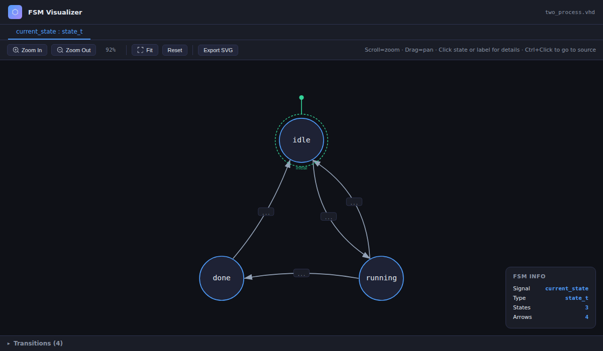
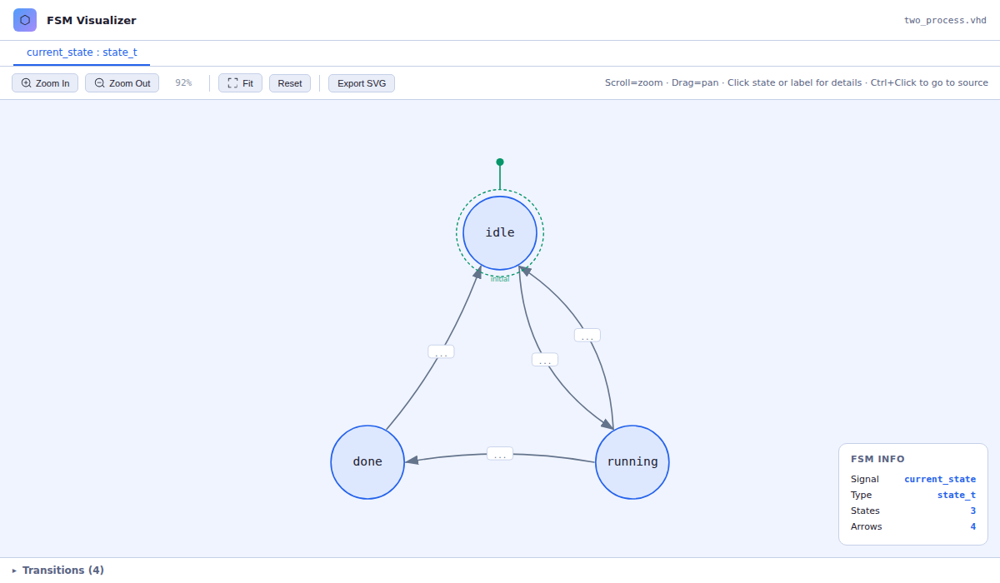
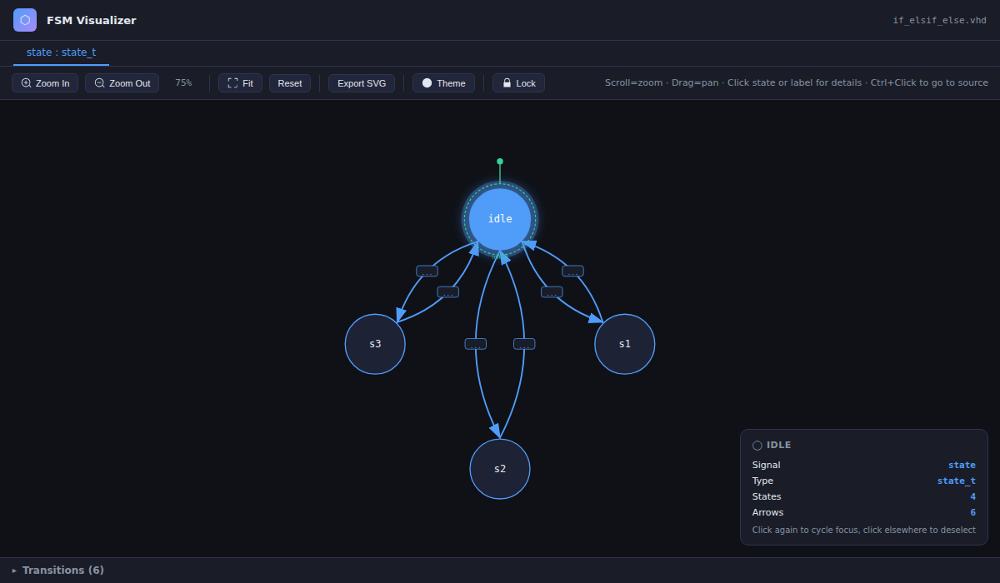
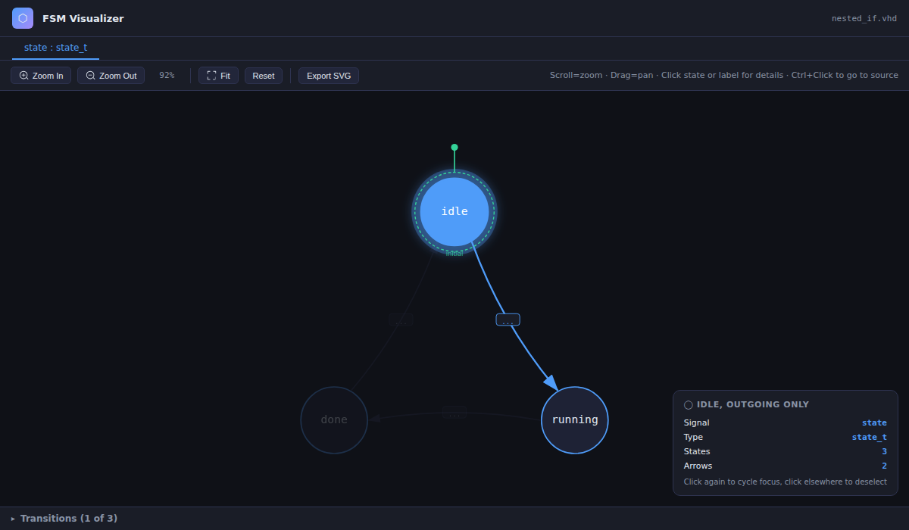
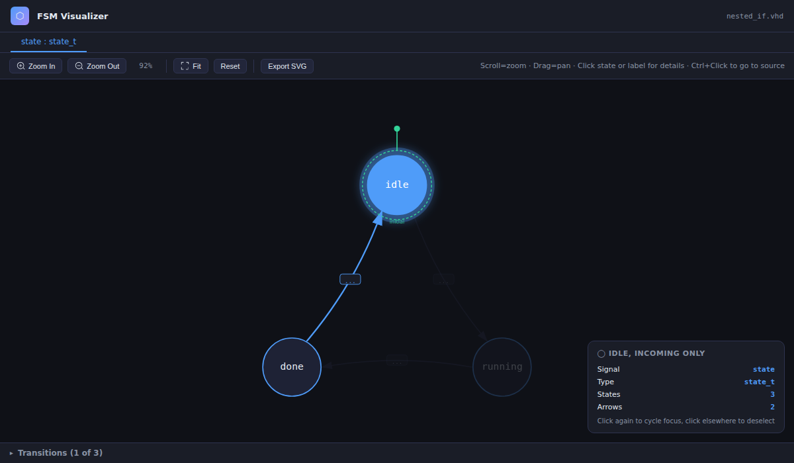
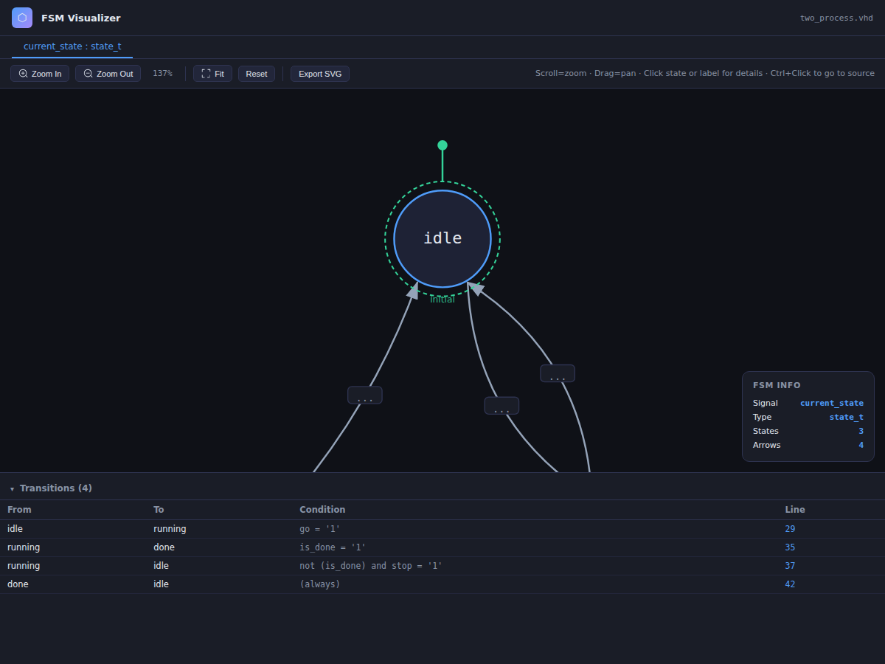
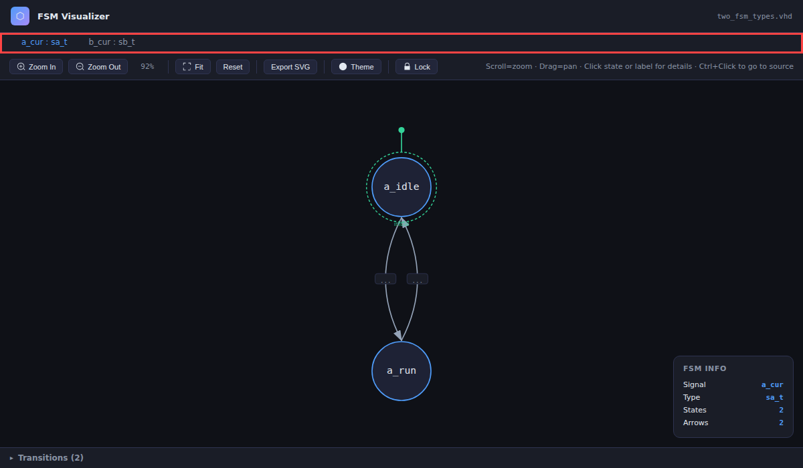
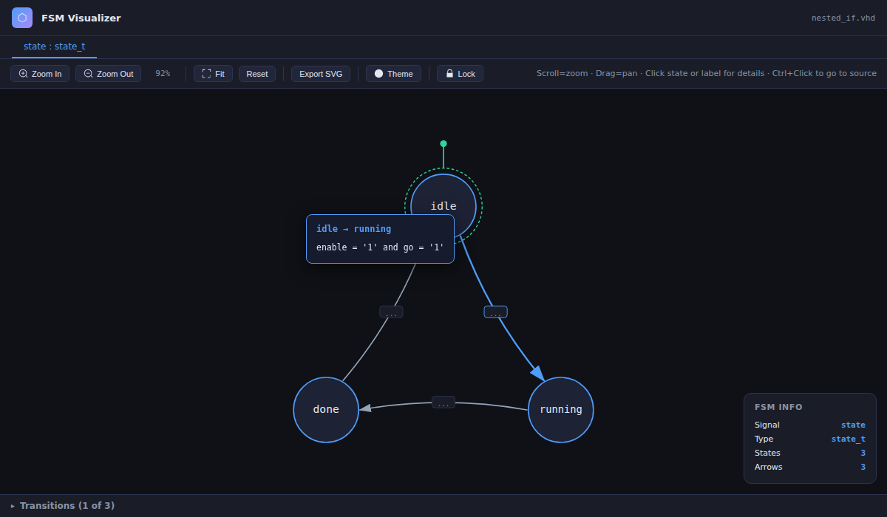

# VHDL FSM Diagram

Automatically detects finite state machines in your VHDL source files and renders them as an
interactive, clickable diagram — right inside VS Code.

## Features

- **Automatic FSM detection** — scans your VHDL file for enum-typed state signals and `case`
  statements, no annotations or configuration required.
- **Two-process FSMs supported** — `current_state` / `next_state` style designs are merged into
  a single diagram.
- **Interactive diagram** — states are laid out in a circle with arrows for each transition.
  Click an arrow to highlight it (and dim the rest); click a state to highlight all of its
  incoming/outgoing transitions.
- **Conditions at a glance** — each transition shows its guard condition. Long condition lists
  are collapsed into a `...` pill — click it to see the full list in a tooltip.
- **Transitions table** — a sortable table of every `From / To / Condition / Line` entry,
  synced with the diagram. Clicking a row highlights the corresponding arrow, and vice versa.
- **Jump to source** — click a transition to jump straight to the line of VHDL that produces it.
- **Export as SVG** — save the diagram as a standalone SVG file for documentation or
  presentations.
- **Auto-refresh on save** — the diagram updates automatically when you save the file
  (configurable).
- **Light / dark / auto theme** — matches your VS Code color theme by default.

## Screenshots

**Dark theme — 3-state two-process FSM**

**Light theme**

**State selected — glow highlight with both directions**

**State selection — outgoing focus mode (click state again to filter)**

**State selection — incoming focus mode (click state a third time)**

**Transitions table — every From / To / Condition / Line in one place**

**Multiple FSMs — separate tabs per enum type**

**Condition tooltip — click `...` to reveal the full guard expression**

## Usage

1. Open a `.vhd` or `.vhdl` file that contains a state-machine `case` statement on an
   enumerated signal (e.g. `type state_t is (idle, running, done);`).
2. Run the command **VHDL: Show FSM Diagram** from:
   - the Command Palette (`Ctrl+Shift+P` / `Cmd+Shift+P`), or
   - the editor toolbar icon, or
   - the right-click context menu.
3. A panel opens showing the FSM diagram alongside a transitions table.

If a file contains multiple FSMs (multiple enum types used as state signals), each one gets its
own tab in the panel.

## Configuration

| Setting | Default | Description |
| --- | --- | --- |
| `vhdl-fsm-diagram.autoRefresh` | `true` | Automatically refresh the diagram when the file is saved. |
| `vhdl-fsm-diagram.theme` | `auto` | Color theme for the FSM diagram (`dark`, `light`, or `auto` to follow the VS Code theme). |

## What gets detected

The parser handles common real-world VHDL idioms, including:

- Single-process and two-process (`current_state` / `next_state`) state machines.
- Nested `if`/`elsif`/`else` and nested `case` statements, with full AND-chained conditions
  (including the implicit negations introduced by `elsif`/`else`).
- `when others =>` and multi-value arms (`when s1 | s2 =>`), expanded into one transition per
  concrete state.
- Both `<=` and `:=` assignments to the state signal.

## Issues & feedback

Found a VHDL construct that isn't detected correctly, or have a feature request?
Please [open an issue on GitHub](https://github.com/Bastocus/vhdl-fsm-diagram/issues).

## License

[MIT](LICENSE)
